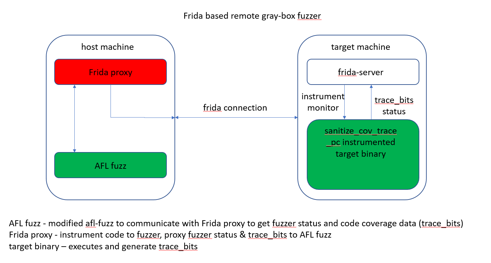

# fridaAFL
fridaAFL is frida + AFL based remote fuzz engine which run afl-fuzz on host while fuzzing target binary on target machine.

# Install && Run
git clone https://github.com/JoeyJiao/fridaAFL
cd fridaAFL
pip3 install --user Cython
cd python-afl
python3 setup.py install --user
cd ../proxy
pip3 install --user frida
npm install
./node_modules/.bin/frida-compile examples/test_aarch64.js  -o proxy.js
cd -
./python-afl/py-afl-fuzz -m none -i input -o findings -- ./proxy/proxy.py -t /data/local/tmp/fuzz-mm-parser
